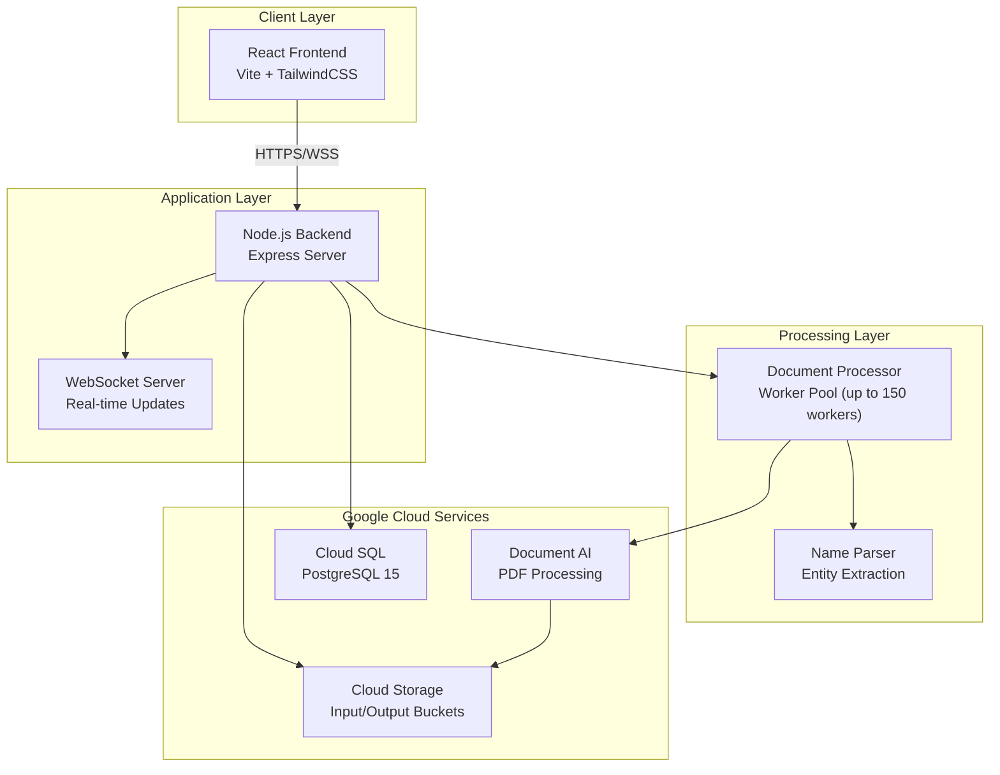
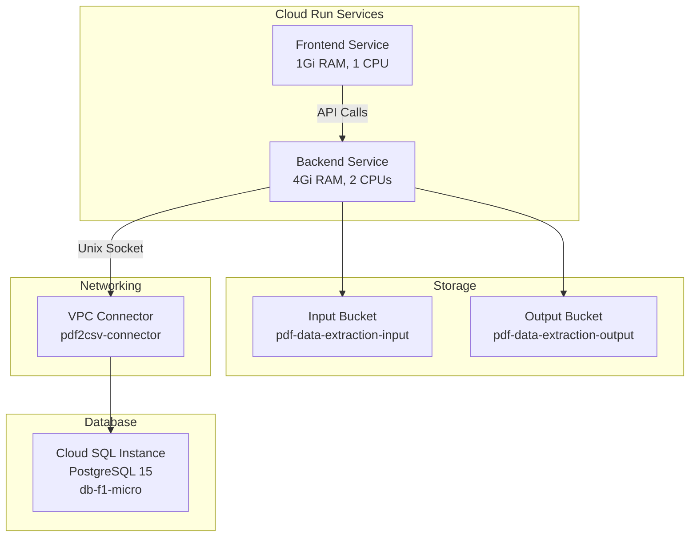

# PDF to CSV/Excel Document Processor

<div align="center">


An intelligent document processing system that extracts structured contact information from PDF files using Google Cloud Document AI, with real-time processing updates and comprehensive data management.

[Features](#-features) • [Architecture](#️-architecture) • [Getting Started](#-getting-started) • [Deployment](#️-deployment) • [API Documentation](#-api-documentation)

</div>

---

## 📋 Table of Contents

- [Overview](#-overview)
- [Features](#-features)
- [Architecture](#️-architecture)
- [Tech Stack](#-tech-stack)
- [Prerequisites](#-prerequisites)
- [Getting Started](#-getting-started)
- [Deployment](#️-deployment)
- [Environment Configuration](#️-environment-configuration)
- [Project Structure](#-project-structure)
- [API Documentation](#-api-documentation)
- [Database Schema](#-database-schema)
- [Contributing](#-contributing)
- [License](#-license)
- [Documentation](#-documentation)

## 📁 Project Structure

```
.  ├── archive/                    # Archived legacy code
.  │   └── legacy-python/         # Python/Streamlit implementation (deprecated)
.  ├── client/                     # React frontend application
.  │   ├── src/
.  │   │   ├── components/        # React components
.  │   │   ├── contexts/          # React contexts (Theme, Toast)
.  │   │   ├── pages/             # Page components
.  │   │   ├── services/          # WebSocket and API services
.  │   │   └── api/               # API client modules
.  │   ├── Dockerfile             # Frontend container image
.  │   └── package.json           # Frontend dependencies
.  ├── server/                     # Node.js backend application
.  │   ├── src/
.  │   │   ├── config/            # Configuration management
.  │   │   ├── controllers/       # Request handlers
.  │   │   ├── models/            # Database models
.  │   │   ├── routes/            # API route definitions
.  │   │   ├── services/          # Business logic (Document AI, batch processing)
.  │   │   └── utils/             # Utility functions
.  │   ├── db/                    # Database schema files
.  │   ├── Dockerfile             # Backend container image
.  │   └── package.json           # Backend dependencies
.  ├── docs/                       # Technical documentation
.  │   ├── ARCHITECTURE.md        # Comprehensive technical guide
.  │   ├── DATABASE.md            # Database documentation
.  │   ├── DEBUGGING.md           # Troubleshooting guide
.  │   ├── TESTING.md             # Testing procedures
.  │   └── sql/                   # Reference SQL scripts
.  ├── migrations/                 # Database migrations
.  ├── test_scripts/              # Testing utilities
.  ├── setup_new_db.sql           # Database setup script
.  ├── deploy.sh                  # GCP deployment script
.  ├── setup-gcp.sh               # GCP infrastructure setup
.  └── cloud-run-config.yaml      # Cloud Run configuration
```

---

## 🎯 Overview

This system automates the extraction of contact information from PDF documents using Google Cloud Document AI. It processes PDFs to extract names, phone numbers, emails, addresses, and other contact details, storing them in a PostgreSQL database with pre-processing and post-processing validation stages.

**Key Capabilities:**
- Batch PDF processing with parallel execution (up to 150 concurrent workers in high-performance mode)
- Real-time WebSocket updates for processing status
- Duplicate detection and data validation
- Export to CSV/Excel formats
- Cloud-native deployment on Google Cloud Run
- Multi-tenant support with customer and collection management

---

## ✨ Features

### Document Processing
- **AI-Powered Extraction**: Leverages Google Document AI for intelligent entity recognition
- **Parallel Processing**: Handles multiple PDFs concurrently with configurable worker pools (up to 150 workers in high-performance mode)
- **Large File Support**: Processes PDFs up to 50MB with optimized memory management
- **Automatic Retry**: Built-in retry logic with exponential backoff for failed requests (3 attempts, 10-minute timeout)

### Data Management
- **Dual-Stage Processing**: Maintains both raw extracted data and validated filtered records
- **Duplicate Detection**: Configurable duplicate detection based on mobile numbers or other fields
- **Audit Trail**: Tracks rejected records with rejection reasons
- **Collection Organization**: Groups documents into collections for better organization

### Real-Time Updates
- **WebSocket Communication**: Live progress updates during document processing
- **Status Tracking**: Monitor upload progress and processing status per file
- **Error Notifications**: Immediate feedback on processing failures

### Export Options
- **CSV Export**: Download extracted data in CSV format
- **Excel Export**: Generate Excel workbooks with formatted data
- **Batch Downloads**: Export entire collections at once

---

## 🏗️ Architecture

### System Architecture



### Processing Pipeline


### Deployment Architecture



---

## 🛠️ Tech Stack

### Backend
- **Runtime**: Node.js 18.x
- **Framework**: Express 5.1.0
- **Database**: PostgreSQL 15.x with `pg` driver
- **AI/ML**: Google Cloud Document AI 9.5.0
- **Storage**: Google Cloud Storage 7.7.0
- **WebSocket**: ws 8.18.3
- **File Processing**: 
  - `express-fileupload` for uploads
  - `csv-writer` for CSV generation
  - `xlsx` for Excel generation
  - `archiver` for ZIP compression
- **Utilities**: 
  - `name-parser` for name entity parsing
  - `p-limit` for concurrency control
  - `dotenv` for configuration

### Frontend
- **Framework**: React 19.1.1
- **Build Tool**: Vite 7.1.12
- **Styling**: TailwindCSS 4.1.15
- **HTTP Client**: Axios 1.12.2
- **Server**: Express 4.18.2 (for static serving)

### Infrastructure
- **Cloud Platform**: Google Cloud Platform
- **Compute**: Cloud Run (managed containers)
- **Database**: Cloud SQL (PostgreSQL 15)
- **Storage**: Cloud Storage (regional buckets)
- **AI Service**: Document AI (custom processor)
- **Networking**: VPC Connector for private connectivity
- **Secrets**: Secret Manager for credentials

### Python Alternative
- **Runtime**: Python 3.8+
- **Libraries**: 
  - `google-cloud-documentai` for Document AI
  - `pandas` for data manipulation
  - `openpyxl` for Excel export

---

## 📦 Prerequisites

Before setting up the project, ensure you have:

| Requirement | Version | Purpose |
|------------|---------|---------|
| Node.js | 18.x | Backend and frontend runtime |
| npm | 8.x+ | Package management |
| PostgreSQL | 15.x | Local database (development) |
| Docker | 20.x+ | Container building |
| Google Cloud SDK | Latest | GCP deployment |
| Python | 3.8+ | Optional: Python processor |

**Google Cloud Requirements:**
- GCP account with billing enabled
- Project Owner or Editor permissions
- Document AI API access

---

## 🚀 Getting Started

### 1. Clone Repository

```bash
git clone <repository-url>
cd pdf-to-csv
```

### 2. Local Database Setup

Create PostgreSQL database and user:

```sql
CREATE DATABASE pdf2csv_db;
CREATE USER pdf2csv_user WITH PASSWORD 'your_password';
GRANT ALL PRIVILEGES ON DATABASE pdf2csv_db TO pdf2csv_user;
```

Initialize schema:

```bash
psql -U pdf2csv_user -d pdf2csv_db -f setup_new_db.sql
```

For detailed database documentation including schema reference, migrations, and maintenance, see [docs/DATABASE.md](docs/DATABASE.md).

### 3. Backend Setup

```bash
cd server
npm install

# Create .env file
cp .env.example .env
# Edit .env with your configuration
```

**Required Environment Variables:**

```env
NODE_ENV=development
PORT=5000

# Google Cloud
PROJECT_ID=your-project-id
LOCATION=us
PROCESSOR_ID=your-processor-id
GOOGLE_APPLICATION_CREDENTIALS=/path/to/credentials.json

# Database
DB_HOST=localhost
DB_PORT=5432
DB_NAME=pdf2csv_db
DB_USER=pdf2csv_user
DB_PASSWORD=your_password
DB_SSL=false

# Cloud Storage
INPUT_BUCKET=pdf-data-extraction-input-bucket
OUTPUT_BUCKET=pdf-data-extraction-output-bucket
STORAGE_LOCATION=us

# Processing
ENABLE_DUPLICATE_DETECTION=true
DUPLICATE_KEY_FIELD=mobile
```

### 4. Frontend Setup

```bash
cd client
npm install

# Create .env file
echo "VITE_API_URL=http://localhost:5000" > .env
echo "VITE_WS_URL=ws://localhost:5000" >> .env
```

### 5. Run Development Servers

```bash
# Terminal 1 - Backend
cd server
npm run dev

# Terminal 2 - Frontend
cd client
npm run dev
```

Access the application at `http://localhost:5173`

---

## ☁️ Deployment

### GCP Infrastructure Setup

Run the automated setup script:

```bash
chmod +x setup-gcp.sh
./setup-gcp.sh
```

This script provisions:
- Cloud SQL PostgreSQL 15 instance (db-f1-micro tier)
- Service account with required IAM roles
- VPC connector for private networking (2-3 instances)
- Secret Manager for database credentials
- Required API enablement

**Configuration Variables:**

| Variable | Default | Description |
|----------|---------|-------------|
| `PROJECT_ID` | pdf2csv-475708 | GCP project identifier |
| `REGION` | us-central1 | Deployment region |
| `INSTANCE_NAME` | pdf2csv-instance | Cloud SQL instance name |
| `DATABASE_NAME` | pdf2csv_db | PostgreSQL database name |

### Document AI Processor Setup

1. Navigate to Document AI in GCP Console
2. Create a new processor (type: Custom Document Extractor)
3. Train the processor to extract:
   - `name` - Full names
   - `mobile` - Mobile phone numbers
   - `address` - Physical addresses
   - `email` - Email addresses
   - `dateofbirth` - Birth dates
   - `landline` - Landline phone numbers
   - `lastseen` - Last seen dates
4. Note the processor ID for configuration

### Deploy to Cloud Run

Run the deployment script:

```bash
chmod +x deploy.sh
./deploy.sh
```

**Verify Deployment:**

```bash
# Check backend service status
gcloud run services describe pdf2csv-backend --region us-central1

# Check frontend service status
gcloud run services describe pdf2csv-frontend --region us-central1

# Test backend health
curl https://pdf2csv-backend-<hash>.run.app/api/test/document-ai

# View logs
gcloud logging read "resource.type=cloud_run_revision AND resource.labels.service_name=pdf2csv-backend" --limit 50
```

**Deployment Verification Checklist:**
- ✅ Backend service responds to health checks
- ✅ Frontend loads and connects to backend
- ✅ WebSocket connection establishes successfully
- ✅ Document AI test endpoint returns success
- ✅ Database connection is established (check logs)
- ✅ Cloud Storage buckets are accessible
- ✅ Environment variables are correctly set

For troubleshooting deployment issues, see [docs/DEBUGGING.md](docs/DEBUGGING.md).

**Deployment Process:**
1. Builds backend Docker image
2. Builds frontend Docker image
3. Deploys backend to Cloud Run (32Gi RAM, 8 CPUs, 1800s timeout for high-performance)
4. Deploys frontend to Cloud Run (1Gi RAM, 1 CPU)
5. Configures environment variables and Cloud SQL connection

**Resource Allocation:**

| Service | Memory | CPU | Timeout | Reason |
|---------|--------|-----|---------|--------|
| Backend | 32Gi | 8 | 1800s | Document AI processing + worker pool (high-performance) |
| Frontend | 1Gi | 1 | 60s | Static file serving |

---

### High-Performance Configuration

This application is optimized for high-resource environments (8 vGPU / 64GB RAM) with aggressive parallel processing:

**Worker Scaling:**
- 1 file → 4 workers
- 2 files → 8 workers
- ≤10 files → 10 workers
- ≤30 files → up to 50 workers
- ≤100 files → 80 workers
- >100 files → 120 workers
- Maximum capacity: 150 concurrent Document AI requests

**Database Configuration:**
- Connection pool: 500 connections (DB_POOL_MAX=500)
- Bulk insert chunk size: 5000 records (DB_INSERT_CHUNK_SIZE=5000)
- Optimized for high-concurrency workloads

**Batch Processing:**
- Concurrent batches: 20 (MAX_CONCURRENT_BATCHES=20)
- Batch timeout: 30 minutes (BATCH_QUEUE_TIMEOUT=1800000)
- Queue capacity: 500 batches (MAX_QUEUE_LENGTH=500)
- Worker threads: 16 (WORKER_THREAD_POOL_SIZE=16)

**Cloud Run Resources:**
- Backend: 32Gi RAM, 8 CPUs, 30-minute timeout
- Frontend: 1Gi RAM, 1 CPU, 60-second timeout

**Note:** These settings prioritize speed and throughput over conservative resource usage. Ensure your Cloud SQL instance and Document AI quotas can support this level of concurrency. For cost optimization, consider scaling down resources during low-traffic periods.


## ⚙️ Environment Configuration

### Backend Environment Variables

```env
# Core Configuration
NODE_ENV=production
PORT=5000

# Google Cloud Configuration
PROJECT_ID=pdf2csv-475708
LOCATION=us
PROCESSOR_ID=9f82bf3d2a02e2ab
GOOGLE_APPLICATION_CREDENTIALS=/app/config/credentials.json

# Database Configuration (Cloud SQL)
DB_HOST=/cloudsql/pdf2csv-475708:us-central1:pdf2csv-instance
DB_PORT=5432
DB_NAME=pdf2csv_new_db
DB_USER=pdf2csv_app_user
DB_PASSWORD=AppUser2024!
DB_SSL=false

# Cloud Storage Configuration
INPUT_BUCKET=pdf-data-extraction-input-bucket
OUTPUT_BUCKET=pdf-data-extraction-output-bucket
STORAGE_LOCATION=us

# Output Configuration
OUTPUT_DIR=output
CSV_FILENAME=extracted_data.csv
EXCEL_FILENAME=extracted_data.xlsx

# Processing Configuration
ENABLE_DUPLICATE_DETECTION=true
DUPLICATE_KEY_FIELD=mobile
```

### Frontend Environment Variables

```env
VITE_API_URL=https://pdf2csv-backend-<hash>.run.app
VITE_WS_URL=wss://pdf2csv-backend-<hash>.run.app
```

---

## 📚 API Documentation

### Document Processing

**Upload Documents**
```http
POST /api/documents/upload
Content-Type: multipart/form-data

Parameters:
- files: PDF file(s)
- collectionId: Collection identifier

Response:
{
  "success": true,
  "message": "Files uploaded successfully",
  "fileIds": [1, 2, 3]
}
```

**Process Documents**
```http
POST /api/documents/process
Content-Type: application/json

Body:
{
  "collectionId": 1
}

Response:
{
  "success": true,
  "message": "Processing started",
  "processedCount": 10
}
```

### Collections Management

**Create Collection**
```http
POST /api/collections
Content-Type: application/json

Body:
{
  "name": "Q4 2024 Leads",
  "customerId": 1
}

Response:
{
  "id": 1,
  "name": "Q4 2024 Leads",
  "customerId": 1,
  "createdAt": "2024-11-10T12:00:00Z"
}
```

**Get Collection**
```http
GET /api/collections/:id

Response:
{
  "id": 1,
  "name": "Q4 2024 Leads",
  "customerId": 1,
  "fileCount": 50,
  "recordCount": 1250,
  "createdAt": "2024-11-10T12:00:00Z"
}
```

### Data Export

**Export CSV**
```http
GET /api/data/export/csv/:collectionId

Response: CSV file download
```

**Export Excel**
```http
GET /api/data/export/excel/:collectionId

Response: Excel file download
```

### WebSocket Events

**Connection**
```javascript
const ws = new WebSocket('wss://your-backend-url');

ws.onopen = () => {
  console.log('Connected to processing updates');
};
```

**Processing Updates**
```javascript
ws.onmessage = (event) => {
  const data = JSON.parse(event.data);
  // data.type: 'progress' | 'complete' | 'error'
  // data.fileId: File identifier
  // data.progress: 0-100
  // data.status: Processing status
};
```

---

## 🗄️ Database Schema

### Tables

**customers**
```sql
CREATE TABLE customers (
  id SERIAL PRIMARY KEY,
  name VARCHAR(255),
  email VARCHAR(255),
  phone VARCHAR(20),
  created_at TIMESTAMP DEFAULT CURRENT_TIMESTAMP
);
```

**collections**
```sql
CREATE TABLE collections (
  id SERIAL PRIMARY KEY,
  customer_id INTEGER REFERENCES customers(id) ON DELETE CASCADE,
  name VARCHAR(255),
  created_at TIMESTAMP DEFAULT CURRENT_TIMESTAMP
);
```

**pre_process_records**
```sql
CREATE TABLE pre_process_records (
  id SERIAL PRIMARY KEY,
  collection_id INTEGER REFERENCES collections(id) ON DELETE CASCADE,
  full_name VARCHAR(255),
  mobile VARCHAR(20),
  email VARCHAR(255),
  address TEXT,
  dateofbirth VARCHAR(50),
  landline VARCHAR(20),
  lastseen VARCHAR(50),
  file_name VARCHAR(255),
  processing_timestamp TIMESTAMP,
  created_at TIMESTAMP DEFAULT CURRENT_TIMESTAMP
);
```

**post_process_records**
```sql
CREATE TABLE post_process_records (
  id SERIAL PRIMARY KEY,
  collection_id INTEGER REFERENCES collections(id) ON DELETE CASCADE,
  first_name VARCHAR(255),
  last_name VARCHAR(255),
  mobile VARCHAR(20),
  email VARCHAR(255),
  address TEXT,
  dateofbirth VARCHAR(50),
  landline VARCHAR(20),
  lastseen VARCHAR(50),
  file_name VARCHAR(255),
  processing_timestamp TIMESTAMP,
  created_at TIMESTAMP DEFAULT CURRENT_TIMESTAMP
);
```

**file_metadata**
```sql
CREATE TABLE file_metadata (
  id SERIAL PRIMARY KEY,
  collection_id INTEGER REFERENCES collections(id) ON DELETE CASCADE,
  original_filename VARCHAR(255),
  cloud_storage_path VARCHAR(500),
  file_size BIGINT,
  processing_status VARCHAR(20) DEFAULT 'processing',
  upload_progress INTEGER DEFAULT 0,
  created_at TIMESTAMP DEFAULT CURRENT_TIMESTAMP
);
```

---

## 🧪 Testing

### Test Document AI Configuration

```bash
curl http://localhost:5000/api/test/document-ai
```

**Expected Response:**
```json
{
  "status": "success",
  "client": "initialized",
  "processor": "accessible",
  "processorName": "projects/pdf2csv-475708/locations/us/processors/9f82bf3d2a02e2ab"
}
```

### Manual Processing Test

```bash
# Upload test PDFs
curl -X POST http://localhost:5000/api/documents/upload \
  -F "files=@test.pdf" \
  -F "collectionId=1"

# Start processing
curl -X POST http://localhost:5000/api/documents/process \
  -H "Content-Type: application/json" \
  -d '{"collectionId": 1}'
```

---

## 🔧 Troubleshooting

### Common Issues

**1. Document AI Authentication Errors**
```bash
# Verify credentials file exists
ls -la /path/to/credentials.json

# Check environment variable
echo $GOOGLE_APPLICATION_CREDENTIALS

# Test authentication
gcloud auth application-default login
```

**2. Database Connection Issues**
```bash
# Test Cloud SQL connection
gcloud sql connect pdf2csv-instance --user=pdf2csv_app_user

# Check VPC connector status
gcloud compute networks vpc-access connectors describe pdf2csv-connector \
  --region=us-central1
```

**3. Memory Issues During Processing**
- Reduce `SAFE_MAX_WORKERS` in `documentProcessor.js`
- Increase Cloud Run memory allocation
- Process files in smaller batches

**4. WebSocket Connection Failures**
- Verify backend URL uses `wss://` (not `ws://`)
- Check CORS configuration in `app.js`
- Ensure Cloud Run allows WebSocket connections

---
<!--
## 📈 Performance Optimization

### Recommendations

1. **Worker Pool Tuning**
   - Adjust `SAFE_MAX_WORKERS` based on Document AI quota
   - Monitor memory usage during processing
   - Use `WORKER_THREAD_POOL_SIZE` for CPU-bound tasks

2. **Database Optimization**
   - Add indexes on frequently queried fields
   - Use connection pooling for high traffic
   - Implement batch inserts for large datasets

3. **Cloud Storage**
   - Use regional buckets close to Cloud Run
   - Enable lifecycle policies for old files
   - Implement multipart uploads for large PDFs

4. **Caching Strategy**
   - Cache Document AI results
   - Implement Redis for session management
   - Use Cloud CDN for frontend assets
---
-->

## 🤝 Contributing

## 📚 Documentation

### Technical Documentation
- **[Architecture Guide](docs/ARCHITECTURE.md)** - Comprehensive technical architecture, file walkthrough, event contracts, and deployment strategies
- **[Testing Guide](docs/TESTING.md)** - Manual and automated testing procedures for batch processing
- **[Debugging Guide](docs/DEBUGGING.md)** - Troubleshooting guide for common batch processing issues
- **[Database Guide](docs/DATABASE.md)** - Database setup, schema reference, migrations, and SQL scripts documentation

### Operational Documentation
- **[Batch Processing Architecture](BATCH_PROCESSING_ARCHITECTURE.md)** - Batch processing event flow and component responsibilities
- **[Queue System](QUEUE_SYSTEM.md)** - Queue configuration, event contracts, and operational guidance
- **[Admin API](ADMIN_API.md)** - Admin endpoints for monitoring and management

For a complete documentation index, see [docs/README.md](docs/README.md).


Contributions are welcome! Please follow these guidelines:

1. Fork the repository
2. Create a feature branch (`git checkout -b feature/AmazingFeature`)
3. Commit your changes (`git commit -m 'Add some AmazingFeature'`)
4. Push to the branch (`git push origin feature/AmazingFeature`)
5. Open a Pull Request

---

## 📞 Support

For issues, questions, or contributions:
- Create an issue on GitHub
- Contact the development team
---

<div align="center">

**Built with ❤️ using Google Cloud Platform**

</div>
